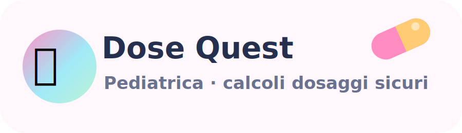
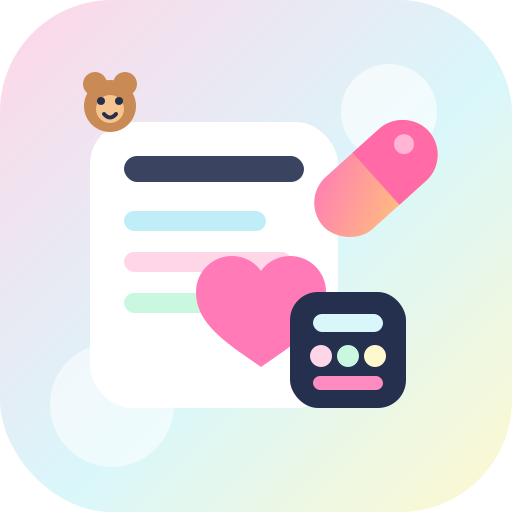

<p align="center">
  
</p>

<p align="center">
  <a href="https://simulazionedidattica.github.io/Dose-Quest-Pediatrica/">
    
  </a>
  
  
  
  
</p>

# Dose Quest Pediatrica

**Dose Quest Pediatrica** è un quiz-simulazione per studenti di **Infermieristica Pediatrica** sui calcoli dei dosaggi farmacologici.

Il quiz è progettato come una mini-missione clinica: lo studente legge il caso, calcola la dose, controlla il passaggio intermedio, risponde e riceve un report finale.

## Link pubblico del quiz

Dopo la pubblicazione su GitHub Pages, il quiz sarà accessibile da:

```text
https://simulazionedidattica.github.io/Dose-Quest-Pediatrica/
```

## Funzioni principali

- 24 casi clinici pediatrici.
- 4 livelli di difficoltà progressiva.
- Calcolatrice integrata.
- Autocontrollo della dose intermedia.
- Micro-alert di sicurezza.
- Report finale con risposte corrette, percentuale e badge.
- Invio automatico al Google Sheet del docente.
- CSV di backup.
- Area docente nascosta agli studenti.

## Missioni didattiche

| Livello | Focus |
|---|---|
| 🍼 Livello 1 | Primi calcoli sicuri: mg/kg e mL |
| 🧃 Livello 2 | Terapia orale pediatrica: sospensioni e ricostituzioni |
| 💧 Livello 3 | Terapia EV e infusioni: mL/h, diluizioni, pompe |
| 🛡️ Livello 4 | Farmaci ad alto rischio: decimali, mcg/mg, doppio controllo |

## Badge finale dello studente

| Risultato | Badge |
|---|---|
| 22-24 corrette | 🛡️ Dose Guardian Pediatrico |
| 18-21 corrette | 🧮 Calcolatore sicuro |
| 14-17 corrette | 🌱 In formazione avanzata |
| meno di 14 | 📘 Ripasso guidato consigliato |

## File corretti da caricare su GitHub

Nella root del repository devono rimanere solo:

```text
index.html
.nojekyll
README.md
assets/dosequest-logo.svg
assets/dosequest-github-icon.svg
```

Se nella repository compare una cartella chiamata `attività`, eliminala e carica la cartella corretta chiamata **assets**.

## Collegamento Google Fogli

Il quiz è già configurato con la Web App Apps Script del docente:

```text
https://script.google.com/macros/s/AKfycbwQgIQdHmSTnOrsBc6fmpQxOexmdWt7cgaujnpgxqlC8rVwu2vwU-fJPjWciUnr4Gmtzw/exec
```

Quando lo studente clicca **Completa**, i risultati vengono inviati automaticamente al foglio Google.

## Area docente

Gli studenti non vedono la pagina **Docente / Google**.

Il collegamento Google resta già configurato nel codice. In caso di necessità tecnica, il docente può aprire l’area impostazioni dalla tastiera del computer con:

```text
CTRL + ALT + D
```

## Icona personalizzata GitHub

Nel pacchetto è presente una piccola icona SVG personalizzata:

```text
assets/dosequest-github-icon.svg
```

Può essere usata nel README come immagine:

```html

```

## Icone Flaticon consigliate

Per sostituire progressivamente le emoji con icone professionali, cerca su Flaticon queste categorie:

- teddy bear
- medicine bottle
- syringe
- calculator
- nurse
- shield check
- clipboard medical
- baby bottle
- hospital bed
- star badge

Se usi le icone gratuite Flaticon, ricordati di rispettare le condizioni di attribuzione previste dal singolo download/account.
